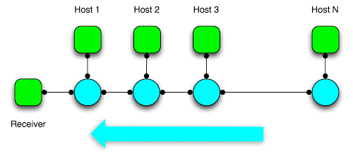
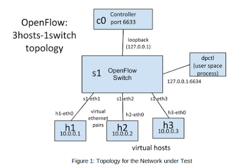
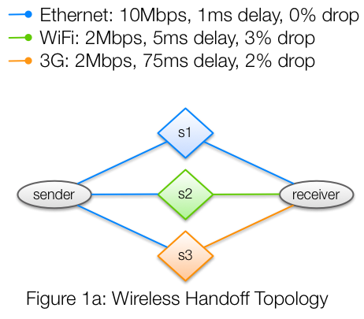

CS6250
======

Project code for CS6250 (Computer Networking) at Georgia Tech for fall 2014, lectures freely available through Udacity. Work done using [Mininet](https://github.com/mininet/mininet/wiki/Introduction-to-Mininet) to simulate network environments.

Nam Pho (npho3@gatech.edu) <br />
Forked from https://github.com/OMS6250/gt-cs6250 on 9/4/14


##Table of Contents
- [Notes](#notes)
- assignment-1 Mininet Setup (10/10)
- [assignment-2](#assignment-2-mininet-topology) Mininet Topology (10/10)
- [assignment-3](#assignment-3-parking-lot) Parking Lot (11.5/10)
- [assignment-4](#assignment-4-learning-switch) Learning Switch (9.5/10)
- [assignment-5](#assignment-5-buffer-bloat) Buffer Bloat (8/10)
- [assignment-6](#assignment-6-tcp-fast-open) TCP Fast Open (9/10)
- [assignment-7](#assignment-7-sdn-and-firewalls) SDN and Firewalls (10/10)
- [assignment-8](#assignment-8-sdn-and-dos-attacks) SDN and DoS Attacks (9.5/10)
- [assignment-9](#assignment-9-replicating-research) Replicating Research (18.5/20)

$Grade = \left(0.5*HW1 + \sum_{i=2}^9 HW_i\right)/95 * 100$

####Notes
1\. Clone the original OMS6250 repo and fork it.

```
$ git clone https://github.com/OMS6250/gt-cs6250.git
```

2\. Adjust the repo to point to your fork and then upstream as the original.

```
$ git remote set-url origin git@github.com:nampho2/CS6250.git
$ git remote add upstream https://github.com/OMS6250/gt-cs6250.git
```

3\. Keep fork in sync with original from Github [docs](https://help.github.com/articles/syncing-a-fork).

```
$ git fetch upstream
$ git checkout master
$ git merge upstream/master
```

4\. Adjust `PYTHONPATH` environment variable to include helpful cross-assignment imports.

```
export PYTHONPATH=`pwd`/lib/:$PYTHONPATH
```

or

```
export PYTHONPATH=/home/mininet/gt-cs6250/lib/:$PYTHONPATH
```


####assignment-2: Mininet Topology


- Run `topology.sh` and review output.
- Modify `mntopo.py` to insert an additional switch between the hosts. Helpful to review Mininet [documentation](https://github.com/mininet/mininet/wiki/Introduction-to-Mininet#wiki-creating) on this.
- Rerun `topology.sh`, output should be similar.
- Test latency by running the ping wrapper, `ping.py`. Should get ~6ms.
- Increase the latency delay from 1ms to 10ms in `mntopo.py`.
- Re-test latency. Should get ~60ms.
- Increase the bandwidth from 10Mbps to 50Mbps in `mntopo.py`.
- Re-run `topology.sh` and review output.


####assignment-3: Parking Lot



- Complete the `__init__` function of the `ParkingLotTopo` class to generalize this for any number of hosts, n > 0. The resulting topology is as shown in the figure above.
- Complete the `run_parkinglot_expt` function to generate TCP flows using `iperf`. 
- Final result is running `sudo ./parkinglot-sweep.sh` to test various parameters of `n = 1, 2, 3, 4, 5`.
- Run my additional `submit.sh` script to collect the output of `parkinglot-sweep.sh` wrapper per submission specifications. Submit all `bwm.txt` files.
- Complete additional quiz questions in `quiz.txt`.


####assignment-4: Learning Switch


- Code `learn_route()` function in `learning-switch.py` code to generate ARP tables.
- Run topology with commands:

```
# symbolically link topology to pyretic
$ ln -s ~/CS6250/assignment-4/learning-switch.py ~/pyretic/pyretic/modules/

# run pyretic first
$ cd ~/pyretic/
$ python pyretic.py -m p0 pyretic.modules.learning-switch

# run mininet in separate terminal
$ cd ~/CS6250/assignment-4/
$ sudo python learning-switch-topo.py

# pingall hosts
mininet> pingall
```

- Answer some quiz questions in `hw4.txt`.
- Note: use `arping` to send single ARP packets and watch the learning switch in action to answer quiz.

```
# install arping in Ubuntu
$ sudo apt-get install arping

# 0. h2 ping (ICMP) h6
mininet> h2 ping h6

# 3. h2 ARP request to h6
mininet> h2 arping -B -c 1 h6

# 4. h6 ARP reply to h2
mininet> h6 arping -b -c 1 -t 00:00:00:00:00:02 h2

# 5. h6 ARP request to h3
mininet> h6 arping -B -c 1 h3

# 6. h3 ARP reply to h6
mininet> h3 arping -b -c 1 -t 00:00:00:00:00:06 h6
```


####assignment-5: Buffer Bloat

Simulate buffer bloat as seen on typical home ISP connection as seen in the figure below:


The corresponding abstract Mininet topology is represented below:


1\. Run select Mininet topology with various buffers and sizes.

```
# 100 packet router buffer
$ sudo ./run.sh

# smaller 20 packet router buffer
$ sudo ./run-minq.sh

# 2 queue router buffer
$ sudo ./run-diff.sh
```

2\. Run monitoring script if desired, `cwnd` data saved to `<title of run>_tcpprobe.txt` file.

```
$ ./monitor.sh <title of run>
```

3\. Saturate the router bandwidth using `iperf` script from `h1` to `h2`, watch the packet flow for ~70s for equilibrium and then request data under resource contention and saturated bandwidth using `wget`.

```
# run iperf script
mininet> h1 ./iperf.sh

# watch packets, wait ~70s
mininet> h2 tail -f ./iperf-recv.txt

# get data under saturated bandwidth using wget
mininet> h2 wget http://10.0.0.1
```

4\. Visualize how router handles resource contention, go to `http://<IP>:8000`.

```
$ sudo ./plot_figures.sh <title of run>
```


####assignment-6: TCP Fast Open

1\. Read the original TCP Fast Open (TFO) paper [[PDF](http://static.googleusercontent.com/external_content/untrusted_dlcp/research.google.com/en/us/pubs/archive/37517.pdf)] to answer quiz questions. Additional useful slides [here](http://www.ietf.org/proceedings/80/slides/tcpm-3.pdf).

2\. Run the simulation and record as `observations.txt` file, basically should show that there are web performance enhancements under TFO vs not TFO. Experiment inspired from other [assignment](http://reproducingnetworkresearch.wordpress.com/2013/03/13/tcp-fastopen/).

```
# install pre-req packages
$ sudo apt-get update 
$ sudo apt-get install vnc4server 
$ sudo apt-get install libnss3-dev 
$ sudo easy_install termcolor

# run simulation
$ vnc4server
$ sudo ./run.sh
```


####assignment-7: SDN and Firewalls

Work with Software Defined Networking (SDN) controllers in Python, specifically POX and Pyretic languages. Use the SDN languages to implement a firewall based on L2 and L3 headers (i.e., IP and MAC addresses) between `h1` and `h2` as shown in the diagram below. 



- Implement the firewall policies in `firewall-policies.csv` by editing `pox_firewall.py` and `pyretic_firewall.py`, a good POX [resource](http://archive.openflow.org/wk/index.php/OpenFlow_Tutorial) for this assignment is and a good Pyretic [resource](https://github.com/frenetic-lang/pyretic/wiki/How-to-use-match).
- Clean up your environment between every run.
- Run your respective controller w/firewall in POX or Pyretic.
- Create networking environment (i.e., run mininet).
- Test if firewall rules are actually implemented in each controller by running `ping` (below).

```
# clean up environment
$ sudo fuser -k 6633/tcp
$ sudo mn -c

# POX setup
$ ln -s ~/CSCS6250/assignment-7/firewall-policies.csv ~/pox/pox/misc/
$ ln -s ~/CSCS6250/assignment-7/pox_firewall.py ~/pox/pox/misc/
$ pox.py log.level --DEBUG forwarding.l2_learning misc.pox_firewall &

# Pyretic setup
$ ln -s ~/CSCS6250/assignment-7/firewall-policies.csv ~/pyretic/pyretic/examples/
$ ln -s ~/CSCS6250/assignment-7/pyretic_firewall.py ~/pyretic/pyretic/examples/
$ pyretic.py pyretic.examples.pyretic_firewall &

# create network
$ sudo mn --topo single,3 --controller remote --mac

# h1 and h2 should drop packets
mininet> h1 ping -c1 h2
mininet> h2 ping -c1 h1

# h3 should not
mininet> h1 ping -c1 h3
mininet> h3 ping -c1 h1

mininet> h2 ping -c1 h3
mininet> h3 ping -c1 h2
```


####assignment-8: SDN and DoS Attacks

- Use [sFlowRT](http://www.inmon.com/products/sFlow-RT.php) to monitor network traffic.
- Use [PyResonance](https://github.com/Resonance-SDN/pyresonance/wiki) to alter network traffic in response to events (e.g., DoS attack).

```
### 1st window (create network)
# start 3 node mn 
$ sudo mn --controller=remote --topo=single,3


### 2nd window (monitoring agent)
# create sFlow agent 
$ sudo ovs-vsctl -- --id=@sflow create sflow agent=eth0 target=\"127.0.0.1:6343\" sampling=2 polling=20 -- -- set bridge s1 sflow=@sflow

# start sFlowRT
$ ./start.sh


### 3rd window (SDN switch)
# copy policy files to pyretic/pyresonance/apps/
# copy config file to pyretic/pyresonance/

# run pyretic switch
$ ./pyretic.py pyretic.pyresonance.main --config=./pyretic/pyresonance/global.config --mode=manual
```

- Make changes to the `dos_policy.py` file to drop DDoS attack connections.
- Test below.

```
# confirm all 3 hosts can ping each other
mininet> pingall

# get console on h1
mininet> xterm h1

# start DoS sttack from h1
$ sudo ping 10.0.0.2 -i .05

# confirm that h1 now blocked from all other hosts
mininet> pingall
```


####assignment-9: Replicating Research

- This is an experiment in Multipath TCP (MPTCP).
- Implement the network topology below by completing TODO sections. 
- Additional quiz questions. 



```
# upgrade kernel
$ sudo ./install_mptcp_raring.sh

# confirm testing env
$ sudo ./test_mptcp.py --bw 10 --mptcp -n 2

# run experiments
$ sudo ./mptcp_handoff.sh
$ sudo ./mptcp_sweep.sh
```


